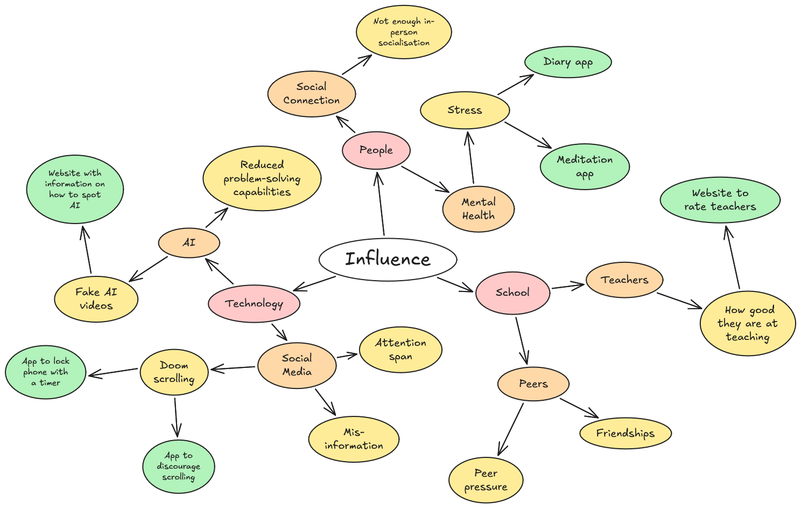
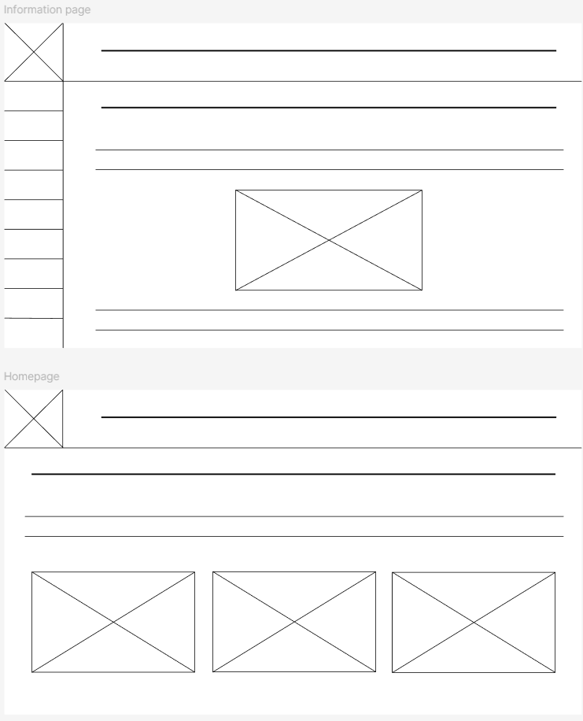
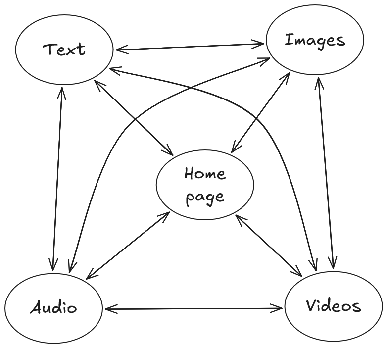

# Identifying and Defining

## Divergent Thinking

### Mindmap

### 6 Big Ideas

## Convergent Thinking

### Impact / Effort Matrix

### Peer SWOT Analysis
#### Charles McDonagh
Is It AI?

S - Simple idea, Possibility to be Executed Well\
W - Simple idea means it needs to be executed well\
O - Topical Sector\
T - Why learn how to when AI detectors already exist?

Rate My Teachers

S - Important for students, important for schools, wide userbase\
W - Difficult to execute, might get you in trouble\
O - Very capable of testing within school\
T - Threatened by other tools within the market already

### Reflect and Choose
According to my impact/effort matrix, *Is It AI?* seems to be the idea to prioritise most as it has a higher impact while requiring lower effort. *Lock In* and *Stop Scrolling* also have a high impact but require a lot more effort as well as skills that I do not have. *Diary App* and *Meditation Nation* are low effort but also low impact, meaning they are not as high priority. *Rate My Teachers* is low impact and high effort making it completely unsuitable for this project. My peer SWOT analysis would suggest that *Is It AI?* is a good option due to it's simplicity, however I would need to execute it very well for it to be of high value.

Overall, it would seem that *Is It AI?* is the best option to go for.

## Requirement Outline
### Functional Requirements
- My website should have multiple pages with information about how to spot AI in different kinds of media (videos, images, music, etc.)
- My website should have a home page with information about the website and links to the other different pages.
- My website should have accessibility features like changing font size or switching between light and dark theme.

### Non-Functional Requirements
- The loading of pages should be quick (<1 s).
- The layout of each page should be consistent to ensure ease of use.
- My website should be consistent across different devices.

# Researching and Planning
## Explore Existing Ideas

## Secondary Research
While artificial intelligence can be a powerful tool, many people use the technology in order to spread misinformation and to trick people. 

Scams often rely on people believing that the person scamming is a person of authority or a loved one in order to make them give money. AI allows for scammers to create more believable and convincing scams. AI can be used to create fake videos or voice recordings of a person, which scammers use to trick people into believing they are a person they know. AI can also be used to create official looking documents or websites and fake social media profiles. ([Scamwatch](https://www.scamwatch.gov.au/stop-check-protect/help-to-spot-and-avoid-scams/how-scammers-use-technology-and-ai))

AI is also used to spread misinformation and disinformation online. This is especially prevalent on social media, where it is difficult to fact-check information. AI spreads misinformation through people not fact-checking information given to them by AI. People can also use AI to create realistic deepfakes of a person to make it seem like they are saying or doing something that they actually did not. ([Global Voices](https://www.globalvoices.org.au/post/preventing-the-spread-of-untruths-via-ai-deepfakes))

This research would suggest that being unable to identify AI-generated content is a serious issue which can result in intentional or unintentional harm.

## Primary Research
[Google Form results](https://docs.google.com/spreadsheets/d/1a1ASSVnU0YJuBZFfTvHRfZ65nwDaUzAyby2CZQEEwVs/edit?usp=sharing)

Based on these results, it seems that people generally have high confidence in their ability to identify AI-generated media and are rarely unable to tell whether a piece of media is AI-generated. This would suggest that my website idea doesn't have as high of an impact as I would have thought. However, the form was only completed by my friends, who use technology frequently, meaning that the target demographic for my website, i.e. people who don't use technology as frequently, may find it more useful than the people who completed the form. One must also consider that these results may be a product of survivorship bias.

## UI / UX Design
### Wireframes

### Storyboard

## Prototype
[Prototype](https://www.figma.com/proto/xf596p1xkJSMwVklJORi4k/CT-Task-2?node-id=27-11&p=f&t=YkxiswASK8t8h612-1&scaling=contain&content-scaling=fixed&page-id=12%3A2&starting-point-node-id=27%3A11)

# Testing and Evaluating

## Peer Evaluation
**William Kim**

UX: 9/10\
Extremely user friendly and uses universal standard layouts that anyone can understand just from looking at it. The use of links that have hover animations help differentiate what is clickable or only an image. Main content area is consistent with every page. The only issue is that it is not easy to identify that the logo is the link to index (and the website name should also be a link as well if the logo is a link).

Aesthetics: 6/10\
It is not modern but still is extremely functional. Hover animations on buttons further improve aesthetics. The buttons with rounded corners and drop shadow effects help make them stand out and unique. The logo and other icons clearly communicate its purpose to the user.

Accuracy: 7/10\
Looking through the content, the information from the website is highly accurate, but credibility could be more easily achieved with sources or footnotes. Know that detecting AI is slightly subjective when someone is told to identify AI on lower quality footage without clear signs.

Influence: 8/10\
Misinformation/Deepfakes from AI is a major problem in this age and this website will be highly useful and influential to help users with identifying AI.

## Evaluation of Issues
My website positively influences users through empowering them with the knowledge of how to spot AI. The website lacks accessibility features, with the only one being the feature to switch between light and dark themes. My website does not collect any user data so that is not a concern. While some of the images in my website were created by me (logo, dark/light mode icon) many of the images were not. The images are properly credited in the credits page, and I'm pretty sure I'm allowed to use them.

## Project Evaluation
I have mostly met the goals I set out for this project. My website has lots of information on how to spot AI-generated content which will hopefully provide a positive influence to the users of my website. The layout of my website is consistent (even more so than I had originally planned in my writeframes/prototype) and each page loads in under one second. One thing that I am unhappy with is how when you are using dark theme and go to a different page, it briefly flashes light theme before switching to dark theme. I could not figure out to how fix this issue but it is only minor. My website is completely messed up on any screen which is not landscape, and I have done minimal testing of different screen sizes so I am not entirely sure it is even suited for all landscape screens. As always, time management was an issue, and I believe that if I had given myself more time my website could have addressed all of these issues and could have been expanded upon further, potentially adding more javascript functionality.